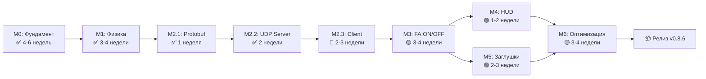

# Дорожная карта разработки U2 v0.8.6

**Обновлено:** 2025-11-18  
**Цель:** Играбельный прототип с релятивистской физикой и FA:ON/OFF

---

## Текущий прогресс

```
[████████████████████████████░░░░░░░░░░░░] 70% фундамента
```

### ✅ Завершено
- **M0.1** - Репозиторий и сборка ✅
- **M0.2** - Математика + валидация + миграция ✅
- **M0.3** - Entitas ECS ✅
- **M1** - Релятивистская физика ✅
- **M2.1** - Protobuf протокол (190/190 тестов) ✅
- **M2.2** - UDP сервер (серверная часть) ✅

### ⚠️ В процессе
- **M2.2** - Client-side (ожидает M2.3) ⏳

### 🔜 Запланировано
- **M2.3** - Client prediction & reconciliation 🔜
- **M3** - FA:ON/OFF + Stabilized 🔜
- **M4** - Минимальный HUD 🔜
- **M5** - Заглушки (урон, боты) 🔜
- **M6** - Оптимизация + платформы 🔜

---

## Критический путь к релизу



---

## Детальный timeline

| Этап | Статус | Время | Начало | Окончание | Приоритет |
|------|--------|-------|--------|-----------|-----------|
| **M0.1** | ✅ Завершён | 1 нед | - | - | - |
| **M0.2** | ✅ Завершён | 2 нед | - | - | - |
| **M0.3** | ✅ Завершён | 2 нед | - | - | - |
| **M1** | ✅ Завершён | 3 нед | - | - | - |
| **M2.1** | ✅ Завершён | 1 нед | - | - | - |
| **M2.2** | ✅ Серверная часть | 2 нед | - | 2025-11-18 | - |
| **M2.3** | 🔴 Следующий | 2-3 нед | 2025-11-18 | 2025-12-09 | **КРИТИЧНО** |
| **M3** | 🟡 Запланирован | 3-4 нед | 2025-12-09 | 2026-01-06 | **ВЫСОКИЙ** |
| **M4** | 🟢 Запланирован | 1-2 нед | 2026-01-06 | 2026-01-20 | СРЕДНИЙ |
| **M5** | 🟢 Запланирован | 2-3 нед | 2026-01-06 | 2026-01-27 | НИЗКИЙ |
| **M6** | 🟡 Запланирован | 3-4 нед | 2026-01-20 | 2026-02-17 | **ВЫСОКИЙ** |

**Итого (оптимистично):** 11 недель от сейчас (~2.5 месяца)  
**Итого (реалистично):** 14 недель от сейчас (~3.5 месяца)  
**Итого (пессимистично):** 18 недель от сейчас (~4.5 месяца)

---

## Следующие 3 шага (immediate actions)

### 1. 🔴 M2.3: Client-Side Prediction & Reconciliation
**Приоритет:** КРИТИЧНО  
**Время:** 2-3 недели  
**Блокирует:** M3, M4, M5, M6

**Задачи:**
- [ ] TypeScript клиент (WebSocket transport)
- [ ] Портировать физику с C# на TypeScript
- [ ] Client-side prediction (input buffering)
- [ ] Reconciliation/replay (sync с сервером)
- [ ] DoD тесты (2 игрока, RTT 50/200ms)

**Документация:** `M2.3-PLAN.md`

---

### 2. 🟡 M3: FA:ON/OFF и Stabilized Ассистент
**Приоритет:** ВЫСОКИЙ  
**Время:** 3-4 недели  
**Зависит от:** M2.3 (для онлайн тестирования)

**Задачи:**
- [ ] M3.1: Переключение FA:ON/OFF (клавиша Z)
- [ ] M3.2: FlightAssistSystem (стабилизация)
  - [ ] Ограничение линейных скоростей
  - [ ] PD-контроллер для вращения
  - [ ] Damping при отпущенном управлении
- [ ] Unit-тесты + онлайн тестирование

**Ключевые фичи:**
- FA:ON: скорости ограничены, вращение гасится
- FA:OFF: полёт по инерции, без ограничений

---

### 3. 🟡 M6: Оптимизация (можно начать параллельно)
**Приоритет:** ВЫСОКИЙ  
**Время:** 3-4 недели  
**Зависит от:** M3 (для финальной оптимизации)

**Задачи:**
- [ ] Профилирование (найти узкие места)
- [ ] Пулы объектов (снаряды, эффекты)
- [ ] Батчинг спрайтов
- [ ] Оптимизация сериализации
- [ ] Spatial culling

**DoD:**
- FPS 60 @ 1080p
- Сеть < 50 кбит/с на клиента
- Server tick < 25 мс

---

## Опциональные этапы (можно отложить)

### M4: Минимальный HUD
**Приоритет:** СРЕДНИЙ  
**Время:** 1-2 недели  
**Можно отложить до:** После M6

**Что включает:**
- Скорость, ускорение, курс
- FA статус (ON/OFF)
- Отладочная информация (F3)

**Обоснование откладывания:**
- Не критично для core механик
- Можно сделать за 1 неделю позже
- Приоритет: M2.3 → M3 → M6

---

### M5: Заглушки (урон, боты)
**Приоритет:** НИЗКИЙ  
**Время:** 2-3 недели  
**Можно отложить до:** После M6 или пропустить

**Что включает:**
- M5.1: Примитивный урон (стрельба, HP)
- M5.2: Примитивные боты (случайное движение)

**Обоснование откладывания:**
- Демонстрационные фичи, не обязательны для MVP
- Фокус на core: физика + FA:ON/OFF + сеть
- Можно добавить в M7+ (расширения)

---

## Риски и митигация

### 🔴 Риск 1: TypeScript физика не совпадает с C#
**Вероятность:** Высокая  
**Влияние:** Критическое

**Митигация:**
- Автоматические тесты (C# vs TypeScript)
- Property-based тесты
- Детерминизм (фиксированный deltaTime)

---

### 🟡 Риск 2: Reconciliation вызывает "прыжки"
**Вероятность:** Средняя  
**Влияние:** Высокое

**Митигация:**
- Tolerance threshold (игнорировать малые ошибки)
- Smooth interpolation
- Адаптивный replay

---

### 🟡 Риск 3: FA:ON ограничения слишком агрессивны
**Вероятность:** Средняя  
**Влияние:** Среднее

**Митигация:**
- Параметризация (настройка констант)
- Playtesting
- Логи и телеметрия

---

### 🟢 Риск 4: Производительность недостаточна
**Вероятность:** Низкая  
**Влияние:** Высокое

**Митигация:**
- Профилирование на ранней стадии
- Architectural reviews
- Постепенная оптимизация (не ждать M6)

---

## Метрики успеха проекта

### Технические метрики
- ✅ **199/199 тестов** (100% passing)
- 🔜 **FPS 60** @ 1080p (M6)
- 🔜 **RTT 50ms**: error < 1м (M2.3)
- 🔜 **RTT 200ms**: convergence < 2 сек (M2.3)
- 🔜 **Сеть**: < 50 кбит/с на клиента (M6)

### Геймплей метрики
- ✅ **Релятивистская физика**: работает (M1)
- 🔜 **FA:ON/OFF**: различимы (M3)
- 🔜 **2 игрока онлайн**: стабильно (M2.3)
- 🔜 **Multiplayer smooth**: RTT 50-200ms (M2.3)

### Документация
- ✅ **Specs**: Полные (14+ документов)
- ✅ **READMEs**: Для каждого milestone
- ✅ **Audits**: M2.1, M2.2 (детальные)
- 🔜 **M2.3-M6**: По завершении

---

## Рекомендации

### Что делать СЕЙЧАС (немедленно)
1. ✅ Создать issue для M2.3
2. ✅ Настроить TypeScript проект (Vite уже есть)
3. ✅ Портировать физику с C# на TypeScript
4. ✅ Реализовать prediction → reconciliation

### Что можно делать ПАРАЛЛЕЛЬНО
- M3 (FlightAssistSystem) — серверная логика
- M6.1 (Профилирование) — найти узкие места

### Что ОТЛОЖИТЬ
- M4 (HUD) — сделать минимальный за 1 неделю позже
- M5 (Заглушки) — пропустить или отложить на M7+

---

## Контакты и ссылки

**Документация:**
- Основной план: `docs/specs/gameplay/spec_u2_dev_plan_v086_minimal.md`
- Следующие шаги: `NEXT-STEPS.md`
- План M2.3: `M2.3-PLAN.md`
- Аудит M2.2: `M2.2-AUDIT.md`

**Репозиторий:** https://github.com/dkomlev/u2

**Версия документа:** 1.0  
**Последнее обновление:** 2025-11-18  
**Статус:** ✅ Готово к исполнению
